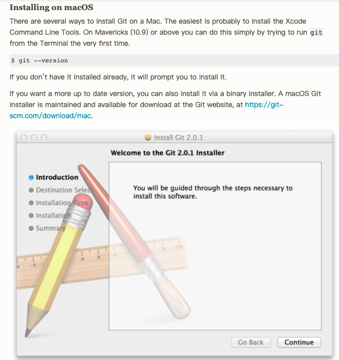
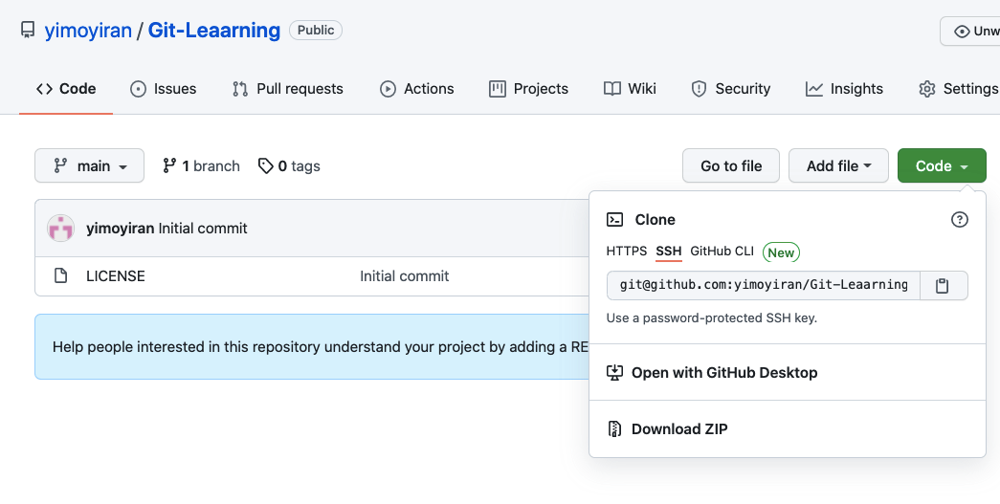

# Git 安装
## Git 官方网站
https://git-scm.com/book/en/v2

## 官方安装网址
https://git-scm.com/book/en/v2/Getting-Started-Installing-Git

### Mac下安装



##设置全局变量
```git config --global --list
git config --global user.name 'ada'
git config --global user.email 'ada@163.com'
--global 
--local
--system
```

# 创建仓库
1. 在已经存在的代码下`git init`

2. 新建仓库，进入目标文件夹`git init my_folder`
   
 `ls -al` 查看 有 .git文件
```
//把需要git管控的文件加入进来 
git add readMe 
//查看文件状态 
git status
//提交文件 -m加修改原因
git commit -m 'create readMe'    
//添加到暂存区+提交一起做
git commit -am ‘create readMe’     
//查看提交日志
git log
```

# git工作区和暂存区

提交单个文件到暂存区
`git add readMe`

提交目录下所有文件到暂存区
`git add -u`


## 
```
//清理暂存区工作路径上所有的文件删掉  慎用 (不是从暂存区回到工作区，而是直接删掉了暂存去里的文件)

git reset --hard
```
```
ibaobao:Git bao$ ls
Git.md			Mac-Git_Install.png
readMe
ibaobao:Git bao$ git add Mac-Git_Install.png
ibaobao:Git bao$ git status
On branch master
Changes to be committed:
  (use "git restore --staged <file>..." to unstage)
	new file:   Mac-Git_Install.png

ibaobao:Git bao$ git reset --hard
HEAD is now at 36f5ff3 add git.md
ibaobao:Git bao$ git status
On branch master
nothing to commit, working tree clean
ibaobao:Git bao$ git status
On branch master
nothing to commit, working tree clean
ibaobao:Git bao$ ls -la
total 16
drwxr-xr-x   5 bao  staff  160  9  7 14:33 .
drwxr-xr-x@  3 bao  staff   96  8 26 11:50 ..
drwxr-xr-x  14 bao  staff  448  9  7 14:33 .git
-rw-r--r--@  1 bao  staff  226  8 31 11:30 Git.md
-rw-r--r--   1 bao  staff   20  9  7 11:47 readMe
```


# 文件重命名
```
git mv readMe readMe.md
git commit -m 'move readMe to readMe.md'
```

```
ibaobao:Git bao$ git mv readMe readMe.md
ibaobao:Git bao$ git status
On branch master
Changes to be committed:
  (use "git restore --staged <file>..." to unstage)
	renamed:    readMe -> readMe.md

ibaobao:Git bao$ git commit -m 'move readMe to readMe.md'
[master 98072d3] move readMe to readMe.md
 1 file changed, 0 insertions(+), 0 deletions(-)
 rename readMe => readMe.md (100%)
```
# 查看文件的演变历史
## 通过gitlog来看文件演变历史 -命令行
```
git log --oneline
//最近两个历史
git log -n2
git log -n2 --oneline 

//-all看所有分支，默认看当前分支
git log -all
git log --oneline -all
//看指定分支
git log --oneline temp
//-graph 可以看出分支结构
git log --oneline --all --graph
//查看分支
git branch -av
//切换分支     .git/HEAD 里记录了这个信息
git checkout master
//基于一个提交创建新的分支temp
git checkout -b temp 132434314
```

```
ibaobao:Git bao$ git log --oneline --all --graph
* b68bf95 (HEAD -> temp) Add temp branch fix
| * 98072d3 (master) move readMe to readMe.md
|/  
* 36f5ff3 add git.md
* 107ce61 Add readMe
```

```
ibaobao:Git bao$ git branch -v
* master 98072d3 move readMe to readMe.md
ibaobao:Git bao$ git log
commit 98072d3b9d009657ab99fd7c91f13a9e9c66274e (HEAD -> master)
Author: Ada <wangjiejingada@163.com>
Date:   Tue Sep 7 14:39:24 2021 +0800

    move readMe to readMe.md

commit 36f5ff39ae469e013af1f8e00d4d3d31c891ce7e
Author: Ada <wangjiejingada@163.com>
Date:   Tue Sep 7 14:16:51 2021 +0800

    add git.md

commit 107ce61751119390133c0cfdbfa38eca801091d1
Author: Ada <wangjiejingada@163.com>
Date:   Tue Sep 7 11:50:42 2021 +0800

    Add readMe
ibaobao:Git bao$ git checkout -b temp 36f5ff39ae469e013af1f8e00d4d3d31c891ce7e
Switched to a new branch 'temp'
ibaobao:Git bao$ git branch -v
  master 98072d3 move readMe to readMe.md
* temp   36f5ff3 add git.md

```

## 图形界面gitk看版本历史
`gitk` 就会弹出图形界面


# .git里的秘密
```
//看是什么信息 -t 看类型 -p 看内容/tree
git cat-file -t 98072d3b9d009657ab99fd7c91f13a9e9c66274e
```
**HEAD**

修改HEAD的内容相当于运行切换分支的命令 
`git checkout temp`

```
ibaobao:Git bao$ ls
Git.md		readMe.md
ibaobao:Git bao$ git status
On branch master
nothing to commit, working tree clean
ibaobao:Git bao$ git checkout temp
Switched to branch 'temp'
ibaobao:Git bao$ git status
On branch temp
nothing to commit, working tree clean

baobao:Git bao$ cd .git
ibaobao:.git bao$ cat HEAD
ref: refs/heads/temp
```

**refs**
存放各个分支或者tag的信息
```
ibaobao:.git bao$ cd refs
ibaobao:refs bao$ ls
heads	tags
ibaobao:refs bao$ cd heads
ibaobao:heads bao$ ls
master	temp
ibaobao:heads bao$ cat master
98072d3b9d009657ab99fd7c91f13a9e9c66274e     //存放的时候指向最后一次commit的指针
ibaobao:heads bao$ git cat-file -t 98072d3b9d009657ab99fd7c91f13a9e9c66274e
commit
ibaobao:heads bao$ git branch -av
* master 98072d3 move readMe to readMe.md
  temp   b68bf95 Add temp branch fix
ibaobao:heads bao$ pwd
/Users/bao/Documents/10-MyNotes/Git/.git/refs/heads
````

**objects**
```
ibaobao:.git bao$ ls
COMMIT_EDITMSG	branches	gitk.cache	info		refs
HEAD		config		hooks		logs
ORIG_HEAD	description	index		objects
ibaobao:.git bao$ cd objects
ibaobao:objects bao$ ls
01	36	75	8a	b6	e1	info
10	72	88	98	c3	ee	pack
ibaobao:objects bao$ cd e1
ibaobao:e1 bao$ ls
e54661083e1607025a01aed09f8dc840feab68
ibaobao:e1 bao$ git cat-file -t e54661083e1607025a01aed09f8dc840feab68
fatal: Not a valid object name e54661083e1607025a01aed09f8dc840feab68
//策略是文件夹名+里边的文件名 
ibaobao:e1 bao$ git cat-file -t e1e54661083e1607025a01aed09f8dc840feab68
tree
ibaobao:e1 bao$ git cat-file -p e1e54661083e1607025a01aed09f8dc840feab68
100644 blob 759f1a6802ef40d7c78ffbaf6fa5c24d4c1c6de4	Git.md
100644 blob c35b048ef38dc71c4b397bfd104d377fc352838a	readMe.md
ibaobao:e1 bao$ git cat-file -t 759f1a6802ef40d7c78ffbaf6fa5c24d4c1c6de4
blob
ibaobao:e1 bao$ git cat-file -p 759f1a6802ef40d7c78ffbaf6fa5c24d4c1c6de4
##Git 官方网站
https://git-scm.com/book/en/v2
## Git 安装
**官方安装网址** ：https://git-scm.com/book/en/v2/Getting-Started-Installing-Git

**Mac下安装**：
```

# git对象彼此关系 commit tree blob
tree相当于一个文件夹
blob具体的文件


# 分离头指针 detached head
> 从某个commit checkout出来但是没有创建分支，会产生分离头指针，需要注意。

> 分离头指针没有和某个分支branch绑定到一起，其上面做的变更会被git一段时间后清理理掉，如果需要保存，则要创建分支

```
ibaobao:Git bao$ git log
commit 98072d3b9d009657ab99fd7c91f13a9e9c66274e (HEAD -> master)
Author: Ada <wangjiejingada@163.com>
Date:   Tue Sep 7 14:39:24 2021 +0800

    move readMe to readMe.md

commit 36f5ff39ae469e013af1f8e00d4d3d31c891ce7e
Author: Ada <wangjiejingada@163.com>
Date:   Tue Sep 7 14:16:51 2021 +0800

    add git.md

commit 107ce61751119390133c0cfdbfa38eca801091d1
Author: Ada <wangjiejingada@163.com>
Date:   Tue Sep 7 11:50:42 2021 +0800

    Add readMe
ibaobao:Git bao$ git checkout 107ce61751119390133c0cfdbfa38eca801091d1
Note: switching to '107ce61751119390133c0cfdbfa38eca801091d1'.

You are in 'detached HEAD' state. You can look around, make experimental
changes and commit them, and you can discard any commits you make in this
state without impacting any branches by switching back to a branch.

If you want to create a new branch to retain commits you create, you may
do so (now or later) by using -c with the switch command. Example:

  git switch -c <new-branch-name>

Or undo this operation with:

  git switch -

Turn off this advice by setting config variable advice.detachedHead to false

HEAD is now at 107ce61 Add readMe
ibaobao:Git bao$ git switch -
Previous HEAD position was 107ce61 Add readMe
Switched to branch 'master'
ibaobao:Git bao$ git log
commit 98072d3b9d009657ab99fd7c91f13a9e9c66274e (HEAD -> master)
Author: Ada <wangjiejingada@163.com>
Date:   Tue Sep 7 14:39:24 2021 +0800

    move readMe to readMe.md

commit 36f5ff39ae469e013af1f8e00d4d3d31c891ce7e
Author: Ada <wangjiejingada@163.com>
Date:   Tue Sep 7 14:16:51 2021 +0800

    add git.md

commit 107ce61751119390133c0cfdbfa38eca801091d1
Author: Ada <wangjiejingada@163.com>
Date:   Tue Sep 7 11:50:42 2021 +0800

    Add readMe
ibaobao:Git bao$ git checkout 107ce61751119390133c0cfdbfa38eca801091d1
Note: switching to '107ce61751119390133c0cfdbfa38eca801091d1'.

You are in 'detached HEAD' state. You can look around, make experimental
changes and commit them, and you can discard any commits you make in this
state without impacting any branches by switching back to a branch.

If you want to create a new branch to retain commits you create, you may
do so (now or later) by using -c with the switch command. Example:

  git switch -c <new-branch-name>

Or undo this operation with:

  git switch -

Turn off this advice by setting config variable advice.detachedHead to false

HEAD is now at 107ce61 Add readMe
ibaobao:Git bao$ ls
readMe
ibaobao:Git bao$ git switch -
Previous HEAD position was 107ce61 Add readMe
Switched to branch 'master'
ibaobao:Git bao$ ls
Git.md		readMe.md
ibaobao:Git bao$ git checkout 107ce61751119390133c0cfdbfa38eca801091d1
Note: switching to '107ce61751119390133c0cfdbfa38eca801091d1'.

You are in 'detached HEAD' state. You can look around, make experimental
changes and commit them, and you can discard any commits you make in this
state without impacting any branches by switching back to a branch.

If you want to create a new branch to retain commits you create, you may
do so (now or later) by using -c with the switch command. Example:

  git switch -c <new-branch-name>

Or undo this operation with:

  git switch -

Turn off this advice by setting config variable advice.detachedHead to false

HEAD is now at 107ce61 Add readMe
ibaobao:Git bao$ ls
readMe
ibaobao:Git bao$ vi readMe
ibaobao:Git bao$ git status
HEAD detached at 107ce61
Changes not staged for commit:
  (use "git add <file>..." to update what will be committed)
  (use "git restore <file>..." to discard changes in working directory)
	modified:   readMe

no changes added to commit (use "git add" and/or "git commit -a")
ibaobao:Git bao$ git commit -am'add detached head comment'
[detached HEAD 4883338] add detached head comment
 1 file changed, 1 insertion(+)
ibaobao:Git bao$ ls
readMe
ibaobao:Git bao$ git log
commit 4883338f92d3cc50f4ed4a958b09cd22ee24a6b6 (HEAD)
Author: Ada <wangjiejingada@163.com>
Date:   Wed Sep 8 11:16:59 2021 +0800

    add detached head comment

commit 107ce61751119390133c0cfdbfa38eca801091d1
Author: Ada <wangjiejingada@163.com>
Date:   Tue Sep 7 11:50:42 2021 +0800

    Add readMe
ibaobao:Git bao$ gitk --all
ibaobao:Git bao$ git checkout master
Warning: you are leaving 1 commit behind, not connected to
any of your branches:

  4883338 add detached head comment

If you want to keep it by creating a new branch, this may be a good time
to do so with:

 git branch <new-branch-name> 4883338

Switched to branch 'master'
ibaobao:Git bao$ gitk --all
ibaobao:Git bao$ git branch fix_defect01 4883338
ibaobao:Git bao$ gitk --all
```

# HEAD 和 branch

HEAD的一些用法
>可以用作标识符，快速指代commit
>
>HEAD 当前commit
>
>HEAD^ 上一个commit  （或者HEAD～）
>
>HEAD^^ 上上一个commit  （或者HEAD～2）

//查看分支
`git branch -av`

//新建分支并切换
`git checkout -b new_branch_name old_branch（或者指定commit）`

//比较分支
git diff HEAD HEAD^
git diff HEAD HEAD~
```
ibaobao:Git bao$ git branch -av
  fix_defect01 4883338 add detached head comment
* master       98072d3 move readMe to readMe.md
  temp         b68bf95 Add temp branch fix
ibaobao:Git bao$ git log
commit 98072d3b9d009657ab99fd7c91f13a9e9c66274e (HEAD -> master)
Author: Ada <wangjiejingada@163.com>
Date:   Tue Sep 7 14:39:24 2021 +0800

    move readMe to readMe.md

commit 36f5ff39ae469e013af1f8e00d4d3d31c891ce7e
Author: Ada <wangjiejingada@163.com>
Date:   Tue Sep 7 14:16:51 2021 +0800

    add git.md

commit 107ce61751119390133c0cfdbfa38eca801091d1
Author: Ada <wangjiejingada@163.com>
Date:   Tue Sep 7 11:50:42 2021 +0800

    Add readMe
ibaobao:Git bao$ git checkout -b fix_readMe fix_defect01
Switched to a new branch 'fix_readMe'
ibaobao:Git bao$ git log -n1
commit 4883338f92d3cc50f4ed4a958b09cd22ee24a6b6 (HEAD -> fix_readMe, fix_defect01)
Author: Ada <wangjiejingada@163.com>
Date:   Wed Sep 8 11:16:59 2021 +0800

    add detached head comment
ibaobao:Git bao$ git branch -av
  fix_defect01 4883338 add detached head comment
* fix_readMe   4883338 add detached head comment
  master       98072d3 move readMe to readMe.md
  temp         b68bf95 Add temp branch fix
ibaobao:Git bao$ cat .git/HEAD
ref: refs/heads/fix_readMe
ibaobao:Git bao$ gitk --all
DEPRECATION WARNING: The system version of Tk is deprecated and may be removed in a future release. Please don't rely on it. Set TK_SILENCE_DEPRECATION=1 to suppress this warning.
2021-09-08 11:53:41.120 Wish[72889:2910006] CoreText note: Client requested name ".SFNSMono-Regular", it will get Times-Roman rather than the intended font. All system UI font access should be through proper APIs such as CTFontCreateUIFontForLanguage() or +[NSFont systemFontOfSize:].
2021-09-08 11:53:41.120 Wish[72889:2910006] CoreText note: Set a breakpoint on CTFontLogSystemFontNameRequest to debug.
2021-09-08 11:53:41.214 Wish[72889:2910006] CoreText note: Client requested name ".SF NS Mono", it will get Times-Roman rather than the intended font. All system UI font access should be through proper APIs such as CTFontCreateUIFontForLanguage() or +[NSFont systemFontOfSize:].
ibaobao:Git bao$ git log
commit 4883338f92d3cc50f4ed4a958b09cd22ee24a6b6 (HEAD -> fix_readMe, fix_defect01)
Author: Ada <wangjiejingada@163.com>
Date:   Wed Sep 8 11:16:59 2021 +0800

    add detached head comment

commit 107ce61751119390133c0cfdbfa38eca801091d1
Author: Ada <wangjiejingada@163.com>
Date:   Tue Sep 7 11:50:42 2021 +0800

    Add readMe
ibaobao:Git bao$ git diff 4883338f 107ce617
diff --git a/readMe b/readMe
index 28385ce..c35b048 100644
--- a/readMe
+++ b/readMe
@@ -1,2 +1 @@
 this is readMe v1.0
-this is in detached head
ibaobao:Git bao$ git diff 107ce617 4883338f
diff --git a/readMe b/readMe
index c35b048..28385ce 100644
--- a/readMe
+++ b/readMe
@@ -1 +1,2 @@
 this is readMe v1.0
+this is in detached head
ibaobao:Git bao$ git diff HEAD HEAD^
diff --git a/readMe b/readMe
index 28385ce..c35b048 100644
--- a/readMe
+++ b/readMe
@@ -1,2 +1 @@
 this is readMe v1.0
-this is in detached head
ibaobao:Git bao$ git diff HEAD^ HEAD
diff --git a/readMe b/readMe
index c35b048..28385ce 100644
--- a/readMe
+++ b/readMe
@@ -1 +1,2 @@
 this is readMe v1.0
+this is in detached head
ibaobao:Git bao$ git diff HEAD^ HEAD^^
fatal: ambiguous argument 'HEAD^^': unknown revision or path not in the working tree.
Use '--' to separate paths from revisions, like this:
'git <command> [<revision>...] -- [<file>...]'
```

# 修改commit的message  【在自己的分支上变更】

修改当前分支最近一次commit 的message
`git commit --amend`
对任意的commit修改message
`git rebase -i parent_commit_no`
```

ibaobao:Git bao$ git commit --amend
[fix_readMe ff12d60] add detached head comments
 Date: Wed Sep 8 11:16:59 2021 +0800
 1 file changed, 1 insertion(+)


ibaobao:Git bao$ git log
commit 284e2cf4754cd2140c8cbbf1717690ad65fe98d6 (HEAD -> fix_readMe)
Author: Ada <wangjiejingada@163.com>
Date:   Wed Sep 8 11:16:59 2021 +0800

    add detached head comments

commit 107ce61751119390133c0cfdbfa38eca801091d1
Author: Ada <wangjiejingada@163.com>
Date:   Tue Sep 7 11:50:42 2021 +0800

    Add readMe
ibaobao:Git bao$ git checkout master
Switched to branch 'master'
ibaobao:Git bao$ git log
commit 98072d3b9d009657ab99fd7c91f13a9e9c66274e (HEAD -> master)
Author: Ada <wangjiejingada@163.com>
Date:   Tue Sep 7 14:39:24 2021 +0800

    move readMe to readMe.md

commit 36f5ff39ae469e013af1f8e00d4d3d31c891ce7e
Author: Ada <wangjiejingada@163.com>
Date:   Tue Sep 7 14:16:51 2021 +0800

    add git.md

commit 107ce61751119390133c0cfdbfa38eca801091d1
Author: Ada <wangjiejingada@163.com>
Date:   Tue Sep 7 11:50:42 2021 +0800

    Add readMe
ibaobao:Git bao$ git rebase -i 107ce61751119390133c0cfdbfa38eca801091d1
[detached HEAD 369d260] add git.md doc
 Date: Tue Sep 7 14:16:51 2021 +0800
 1 file changed, 8 insertions(+)
 create mode 100644 Git.md
Successfully rebased and updated refs/heads/master.
```


# 合并commit

## 合并历史树中连续的几个commit

`git rebase -i parent_commmit`
>use squash

<image src="./image/rebase_combine_commit" style="zoom:100%;" />

```
ibaobao:Git bao$ git log
commit 9546e6d447873a5bff8cddf62f656dd36d750116 (HEAD -> master)
Author: Ada <wangjiejingada@163.com>
Date:   Wed Sep 8 14:46:14 2021 +0800

    Add image

commit a3f405334356202cce5efaf5888f17c7038814ec
Author: Ada <wangjiejingada@163.com>
Date:   Tue Sep 7 14:39:24 2021 +0800

    move readMe to readMe.md

commit 369d260ebeea450f377b664549a3414368ebda5d
Author: Ada <wangjiejingada@163.com>
Date:   Tue Sep 7 14:16:51 2021 +0800

    add git.md doc

commit 107ce61751119390133c0cfdbfa38eca801091d1
Author: Ada <wangjiejingada@163.com>
Date:   Tue Sep 7 11:50:42 2021 +0800

    Add readMe
ibaobao:Git bao$ git rebase -i 107ce61751119390133c0cfdbfa38eca801091d1
[detached HEAD 80df236] To create a complete git.md with image
 Date: Tue Sep 7 14:16:51 2021 +0800
 2 files changed, 8 insertions(+)
 create mode 100644 Git.md
 rename readMe => readMe.md (100%)
Successfully rebased and updated refs/heads/master.
ibaobao:Git bao$ git log
commit 6c435f6c96d3f98f9d8b164adf8143608190ad6e (HEAD -> master)
Author: Ada <wangjiejingada@163.com>
Date:   Wed Sep 8 14:46:14 2021 +0800

    Add image

commit 80df2361de593f362ce9b64398209b9ceba3a5a0
Author: Ada <wangjiejingada@163.com>
Date:   Tue Sep 7 14:16:51 2021 +0800

    To create a complete git.md with image
    
    add git.md doc
    
    move readMe to readMe.md

commit 107ce61751119390133c0cfdbfa38eca801091d1
Author: Ada <wangjiejingada@163.com>
Date:   Tue Sep 7 11:50:42 2021 +0800

    Add readMe
```

## 合并不连续的commit
`git rebase -i parent_commit_no`
在交互的时候，把不连续的需要合并的commit拷贝到一起，然后squash

# 如何比较暂存区和HEAD的文件
git diff --cached `

```
ibaobao:Git bao$ git status
On branch master
Changes not staged for commit:
  (use "git add <file>..." to update what will be committed)
  (use "git restore <file>..." to discard changes in working directory)
	modified:   Git.md

no changes added to commit (use "git add" and/or "git commit -a")
ibaobao:Git bao$ git add Git.md
ibaobao:Git bao$ git diff --cached 
```

# 如何比较工作区和暂存区所含文件的差异
**理解什么是工作区（当前工作路径，还没add到暂存区的），暂存区（add但是还没提交的）和HEAD（提交以后的）**

默认比较工作区与暂存区 
`git diff` 

# 如何将暂存区恢复成HEAD
1. 恢复全部暂存区的文件 和HEAD一致

    `git reset HEAD`
    

2. `git reset HEAD -- file1 file2 file3`

     or 

     `Changes to be committed:
    (use "git restore --staged <file>..." to unstage)`
3. 恢复指定的工作区的文件（恢复成和暂存区一样，相当于从暂存区拷贝到工作区）

    `git checkout -- file_name`

```
ibaobao:Git bao$ git status
On branch master
Changes to be committed:
  (use "git restore --staged <file>..." to unstage)
	modified:   Git.md
	modified:   readMe.md

Changes not staged for commit:
  (use "git add <file>..." to update what will be committed)
  (use "git restore <file>..." to discard changes in working directory)
	modified:   readMe.md

ibaobao:Git bao$ git diff
diff --git a/readMe.md b/readMe.md
index aae1b64..40145fb 100644
--- a/readMe.md
+++ b/readMe.md
@@ -1,2 +1,3 @@
 this is readMe v1.0
-this is my changes
+this is my changes test
+
ibaobao:Git bao$ git checkout -- readMe.md
ibaobao:Git bao$ git diff
ibaobao:Git bao$ git status
On branch master
Changes to be committed:
  (use "git restore --staged <file>..." to unstage)
	modified:   Git.md
	modified:   readMe.md


    ibaobao:Git bao$ git status
On branch master
Changes to be committed:
  (use "git restore --staged <file>..." to unstage)
	modified:   Git.md

Changes not staged for commit:
  (use "git add <file>..." to update what will be committed)
  (use "git restore <file>..." to discard changes in working directory)
	modified:   readMe.md

ibaobao:Git bao$ git add readMe.md
ibaobao:Git bao$ git status
On branch master
Changes to be committed:
  (use "git restore --staged <file>..." to unstage)
	modified:   Git.md
	modified:   readMe.md
```

```
ibaobao:Git bao$ git status
On branch master
Changes to be committed:
  (use "git restore --staged <file>..." to unstage)
	modified:   Git.md

Changes not staged for commit:
  (use "git add <file>..." to update what will be committed)
  (use "git restore <file>..." to discard changes in working directory)
	modified:   readMe.md

ibaobao:Git bao$ git diff
diff --git a/readMe.md b/readMe.md
index c35b048..aae1b64 100644
--- a/readMe.md
+++ b/readMe.md
@@ -1 +1,2 @@
 this is readMe v1.0
+this is my changes
ibaobao:Git bao$ vi readMe.md
ibaobao:Git bao$ git restore --staged readMe.md
ibaobao:Git bao$ git diff
diff --git a/readMe.md b/readMe.md
index c35b048..30d42e0 100644
--- a/readMe.md
+++ b/readMe.md
@@ -1 +1,2 @@
-this is readMe v1.0
+qqqqthis is readMe v1.0
+this is my changes
ibaobao:Git bao$ git status
On branch master
Changes to be committed:
  (use "git restore --staged <file>..." to unstage)
	modified:   Git.md

Changes not staged for commit:
  (use "git add <file>..." to update what will be committed)
  (use "git restore <file>..." to discard changes in working directory)
	modified:   readMe.md

ibaobao:Git bao$ cat readMe.md
qqqqthis is readMe v1.0
this is my changes
ibaobao:Git bao$ git add readMe.md
ibaobao:Git bao$ git status
On branch master
Changes to be committed:
  (use "git restore --staged <file>..." to unstage)
	modified:   Git.md
	modified:   readMe.md

ibaobao:Git bao$ git reset HEAD -- readMe.md
Unstaged changes after reset:
M	readMe.md
ibaobao:Git bao$ cat readMe.md
qqqqthis is readMe v1.0
this is my changes
ibaobao:Git bao$ git status
On branch master
Changes to be committed:
  (use "git restore --staged <file>..." to unstage)
	modified:   Git.md

Changes not staged for commit:
  (use "git add <file>..." to update what will be committed)
  (use "git restore <file>..." to discard changes in working directory)
	modified:   readMe.md

ibaobao:Git bao$ cat readMe.md
qqqqthis is readMe v1.0
this is my changes
```

# 回退前面几次commit

`git reset --hard des_commit`  加上想回退到的commit代码
```
ibaobao:Git bao$ git log --graph
* commit b68bf950b69cdc0def97f0af4056ca656f86b3e5 (HEAD -> temp)
| Author: Ada <wangjiejingada@163.com>
| Date:   Tue Sep 7 15:13:27 2021 +0800
| 
|     Add temp branch fix
| 
* commit 36f5ff39ae469e013af1f8e00d4d3d31c891ce7e
| Author: Ada <wangjiejingada@163.com>
| Date:   Tue Sep 7 14:16:51 2021 +0800
| 
|     add git.md
| 
* commit 107ce61751119390133c0cfdbfa38eca801091d1
  Author: Ada <wangjiejingada@163.com>
  Date:   Tue Sep 7 11:50:42 2021 +0800
  
      Add readMe
ibaobao:Git bao$ git reset --hard 107ce61751119390133c0cfdbfa38eca801091d1
HEAD is now at 107ce61 Add readMe
ibaobao:Git bao$ git log
commit 107ce61751119390133c0cfdbfa38eca801091d1 (HEAD -> temp)
Author: Ada <wangjiejingada@163.com>
Date:   Tue Sep 7 11:50:42 2021 +0800

    Add readMe

```

# 比较不同分支commit的指定的文件差异
`git diff master temp -- file`
也可以用分支对应的id去比较


```
ibaobao:Git bao$ git diff master temp -- readMe.md
ibaobao:Git bao$ git branch -av
  fix_defect01 4883338 add detached head comment
  fix_readMe   284e2cf add detached head comments
* master       0006f39 Submit
  temp         107ce61 Add readMe
ibaobao:Git bao$ git 0006f39 107ce61 --readMe.md
```

# 删除文件

删除file直接会进去暂存区
`git rm file`


```
ibaobao:Git bao$ ls
Git.md		image		readMe.md	test
ibaobao:Git bao$ cat test
test
ibaobao:Git bao$ git add test
ibaobao:Git bao$ git commit -m'add test'
[master e83378a] add test
 1 file changed, 1 insertion(+)
 create mode 100644 test
ibaobao:Git bao$ git status
On branch master
nothing to commit, working tree clean
ibaobao:Git bao$ git rm test
rm 'test'
ibaobao:Git bao$ git status
On branch master
Changes to be committed:
  (use "git restore --staged <file>..." to unstage)
	deleted:    test

ibaobao:Git bao$ ls
Git.md		image		readMe.md
ibaobao:Git bao$ git commit -m'delet test'
[master f72e1e2] delet test
 1 file changed, 1 deletion(-)
 delete mode 100644 test
ibaobao:Git bao$ git status
On branch master
nothing to commit, working tree clean
```
# Git的备份
## 传输协议
|协议|协议格式|协议类型|
|---|---|---|
| 本地协议一|/path/to/repo.git| 哑协议|
| 本地协议二 | file:///path/to/repo.git| 智能协议|
| http/https协议 | http://git-server.com:prt/path/to/repo.git | 智能协议|
| ssh协议 |user@git-server.com：path/to/repo.git   | 工作中常用的智能协议|

`git clone --bare file:///Users/bao/Documents/10-MyNotes/Git/.git zhineng.git `

`git push 备份区` 在工作区执行此命令即可直接同步本地备份数据
(如果有提示，需要设置上游分支 `git push --set-upstream zhineng  myBranch`)

### 本地使用哑协议克隆备份
```
--创建本地备份文件夹，并执行clone
ibaobao:10-MyNotes bao$ mkdir git-backup
ibaobao:10-MyNotes bao$ cd git-back
ibaobao:git-backup bao$ git clone --bare /Users/bao/Documents/10-MyNotes/Git/.git ya.git
Cloning into bare repository 'ya.git'...
done.
```
### 本地使用智能协议克隆备份 - 有clone进度条，有压缩，速度快
```
ibaobao:git-backup bao$ git clone --bare file:///Users/bao/Documents/10-MyNotes/Git/.git zhineng.git
Cloning into bare repository 'zhineng.git'...
remote: Enumerating objects: 35, done.
remote: Counting objects: 100% (35/35), done.
remote: Compressing objects: 100% (27/27), done.
remote: Total 35 (delta 6), reused 0 (delta 0), pack-reused 0
Receiving objects: 100% (35/35), 327.38 KiB | 12.13 MiB/s, done.
Resolving deltas: 100% (6/6), done.
ibaobao:git-backup bao$ ls
ya.git		zhineng.git

```
```
--切换回工作区


ibaobao:Git bao$ git remote add zhineng file:///Users/bao/Documents/10-MyNotes/git-backup/zhineng.git
ibaobao:Git bao$ git remote -v

zhineng	file:///Users/bao/Documents/10-MyNotes/git-backup/zhineng.git (fetch)
zhineng	file:///Users/bao/Documents/10-MyNotes/git-backup/zhineng.git (push)

ibaobao:Git bao$ git checkout -b testBranch c242b886faf7ff2f74cb0f8e91bde5f2c1f6dfea
Switched to a new branch 'testBranch'

baobao:Git bao$ cd /Users/bao/Documents/10-MyNotes/Git
ibaobao:Git bao$ git branch -av
  fix_defect01 4883338 add detached head comment
  fix_readMe   284e2cf add detached head comments
  master       c242b88 add github_ssh_link.png
  temp         107ce61 Add readMe
* testBranch   c242b88 add github_ssh_link.png
ibaobao:Git bao$ git push zhineng
Enumerating objects: 6, done.
Counting objects: 100% (6/6), done.
Delta compression using up to 4 threads
Compressing objects: 100% (4/4), done.
Writing objects: 100% (4/4), 84.30 KiB | 3.37 MiB/s, done.
Total 4 (delta 0), reused 0 (delta 0), pack-reused 0
To file:///Users/bao/Documents/10-MyNotes/git-backup/zhineng.git
 * [new branch]      testBranch -> testBranch
 * 
```

`git remote -v`

## 遇到紧急任务，需要把手头工作存起来
工作区有文件在暂存区，有些还在修改

`git stash`  将当前工作区状态存起来

`git stash list`  可以查看存起来的工作区stack

`git stash apply` 最上面的工作区内容恢复，但是不出栈，可以反复用

`git stash pop`  最上面的工作区内容恢复，工作区内容出栈，stash里删除对应状态

```shell
ibaobao:Git bao$ git stash
Saved working directory and index state WIP on add_git_commands: a118f1a git mv readMe.md readMe.txt
ibaobao:Git bao$ git pull
remote: Enumerating objects: 8, done.
remote: Counting objects: 100% (8/8), done.
remote: Compressing objects: 100% (2/2), done.
remote: Total 5 (delta 3), reused 5 (delta 3), pack-reused 0
Unpacking objects: 100% (5/5), 553 bytes | 69.00 KiB/s, done.
From github.com:yimoyiran/Git-Leaarning
   a118f1a..152284d  feature/add_git_commands -> github/feature/add_git_commands
Updating a118f1a..152284d
Fast-forward
 readMe.txt | 2 +-
 1 file changed, 1 insertion(+), 1 deletion(-)
ibaobao:Git bao$ git stash list
stash@{0}: WIP on add_git_commands: a118f1a git mv readMe.md readMe.txt
ibaobao:Git bao$ git pull
Already up to date.
ibaobao:Git bao$ git status
On branch feature/add_git_commands
Your branch is up to date with 'github/feature/add_git_commands'.

nothing to commit, working tree clean
ibaobao:Git bao$ git stash apply
On branch feature/add_git_commands
Your branch is up to date with 'github/feature/add_git_commands'.

Changes to be committed:
  (use "git restore --staged <file>..." to unstage)
	new file:   index.html

Changes not staged for commit:
  (use "git add <file>..." to update what will be committed)
  (use "git restore <file>..." to discard changes in working directory)
	modified:   Git.md

ibaobao:Git bao$ git stash list
stash@{0}: WIP on add_git_commands: a118f1a git mv readMe.md readMe.txt
ibaobao:Git bao$ git stash pop
error: Your local changes to the following files would be overwritten by merge:
	Git.md
Please commit your changes or stash them before you merge.
Aborting
The stash entry is kept in case you need it again.
--重置工作区内容
ibaobao:Git bao$ git reset --hard HEAD
HEAD is now at 152284d Merge branch 'feature/add_git_commands' of github.com:yimoyiran/Git-Leaarning into feature/add_git_commands_yimo
ibaobao:Git bao$ git status
On branch feature/add_git_commands
Your branch is up to date with 'github/feature/add_git_commands'.

nothing to commit, working tree clean
ibaobao:Git bao$ git stash pop
On branch feature/add_git_commands
Your branch is up to date with 'github/feature/add_git_commands'.

Changes to be committed:
  (use "git restore --staged <file>..." to unstage)
	new file:   index.html

Changes not staged for commit:
  (use "git add <file>..." to update what will be committed)
  (use "git restore <file>..." to discard changes in working directory)
	modified:   Git.md

Dropped refs/stash@{0} (41aa72f307db4c6f0ac864cd7e6395d136244aa8)
ibaobao:Git bao$ git status
On branch feature/add_git_commands
Your branch is up to date with 'github/feature/add_git_commands'.

Changes to be committed:
  (use "git restore --staged <file>..." to unstage)
	new file:   index.html

Changes not staged for commit:
  (use "git add <file>..." to update what will be committed)
  (use "git restore <file>..." to discard changes in working directory)
	modified:   Git.md

ibaobao:Git bao$ git commit -m "Add index.html"
[feature/add_git_commands 2237970] Add index.html
 1 file changed, 1 insertion(+)
 create mode 100644 index.html

```
# GITHUB 

## 配置公私钥
1. 查看是否已经存在ssh key

* Enter ls -al ~/.ssh to see if existing SSH keys are present:
```
$ ls -al ~/.ssh
```
* Lists the files in your .ssh directory, if they exist
Check the directory listing to see if you already have a public SSH key. By default, the filenames of the public keys are one of the following:
```
id_rsa.pub
id_ecdsa.pub
id_ed25519.pub
```
### 创建公钥：
`
ssh-keygen -t ed25519 -C "your_email@example.com"`

如果是旧的系统，可以用如下命令：

`ssh-keygen -t rsa -b 4096 -C "wangjiejingada@163.com"`

将公钥粘贴到github账户上

```
ibaobao:~ bao$ ssh-keygen -t rsa -b 4096 -C "wangjiejingada@163.com"
Generating public/private rsa key pair.
Enter file in which to save the key (/Users/bao/.ssh/id_rsa): 
Created directory '/Users/bao/.ssh'.
Enter passphrase (empty for no passphrase): 
Enter same passphrase again: 
Your identification has been saved in /Users/bao/.ssh/id_rsa.
Your public key has been saved in /Users/bao/.ssh/id_rsa.pub.
The key fingerprint is:
SHA256:mQ+ZJ8ZDdE2xtp1qV1AflWKg4dhTM9jvUJ7ANkWu0W0 wangjiejingada@163.com
The key's randomart image is:
+---[RSA 4096]----+
|        ..=B*+ .=|
|       .+o+**=.oo|
|       ..=..Xo+E.|
|       o =.oo*.o |
|        S ..+ o .|
|       . *   o . |
|          . o .  |
|           . .   |
|                 |
+----[SHA256]-----+
ibaobao:~ bao$ cd ~/.ssh
ibaobao:.ssh bao$ ls
id_rsa		id_rsa.pub


ibaobao:.ssh bao$ ssh-keygen -t ed25519 -C "wangjiejingada@163.com"
Generating public/private ed25519 key pair.
Enter file in which to save the key (/Users/bao/.ssh/id_ed25519): 
Enter passphrase (empty for no passphrase): 
Enter same passphrase again: 
Your identification has been saved in /Users/bao/.ssh/id_ed25519.
Your public key has been saved in /Users/bao/.ssh/id_ed25519.pub.
The key fingerprint is:
SHA256:bv+2CMusYn8tPTAuEz7IoCN5Rziwa2kS94Il+mCBuXY wangjiejingada@163.com
The key's randomart image is:
+--[ED25519 256]--+
|                 |
|                 |
|                 |
|o.               |
|o+ .    S        |
|+.B . ..o        |
|+%.E o o+=       |
|%=+ B =++++..    |
|=+.+ oo*+.o+o.   |
+----[SHA256]-----+
ibaobao:.ssh bao$ ls -al ~/.ssh
total 32
drwx------   6 bao  staff   192  9 13 11:19 .
drwxr-xr-x+ 48 bao  staff  1536  9 13 11:10 ..
-rw-------   1 bao  staff   419  9 13 11:19 id_ed25519
-rw-r--r--   1 bao  staff   104  9 13 11:19 id_ed25519.pub
-rw-------   1 bao  staff  3389  9 13 11:10 id_rsa
-rw-r--r--   1 bao  staff   748  9 13 11:10 id_rsa.pub
```

 

## Git本地仓库同步到github
`git remote add github git@github.com:yimoyiran/Git-Leaarning.git`
其中`git@github.com:yimoyiran/Git-Leaarning.git`从github上创建的仓库中复制，注意协议选择，这里是ssh协议

```
ibaobao:Git bao$ pwd
/Users/bao/Documents/10-MyNotes/Git
ibaobao:Git bao$ git remote add github git@github.com:yimoyiran/Git-Leaarning.git
ibaobao:Git bao$ git remote -v
github	git@github.com:yimoyiran/Git-Leaarning.git (fetch)
github	git@github.com:yimoyiran/Git-Leaarning.git (push)
```

同步所有分支到远程github：
`git push github --all`

同步指定分支到远程github：
`git push github master`

从github吧分支main拉下来：
`git pull github main`

把不相关的两棵树merge在一起：
当前branch切换到master，然后执行以下命令，相当于要merge master 与 远程的github\main

`git merge github/main`

```
ibaobao:Git bao$ git pull github main
remote: Enumerating objects: 3, done.
remote: Counting objects: 100% (3/3), done.
remote: Compressing objects: 100% (2/2), done.
remote: Total 3 (delta 0), reused 0 (delta 0), pack-reused 0
Unpacking objects: 100% (3/3), 1.17 KiB | 240.00 KiB/s, done.
From github.com:yimoyiran/Git-Leaarning
 * branch            main       -> FETCH_HEAD
 * [new branch]      main       -> github/main
hint: Pulling without specifying how to reconcile divergent branches is
hint: discouraged. You can squelch this message by running one of the following
hint: commands sometime before your next pull:
hint: 
hint:   git config pull.rebase false  # merge (the default strategy)
hint:   git config pull.rebase true   # rebase
hint:   git config pull.ff only       # fast-forward only
hint: 
hint: You can replace "git config" with "git config --global" to set a default
hint: preference for all repositories. You can also pass --rebase, --no-rebase,
hint: or --ff-only on the command line to override the configured default per
hint: invocation.
fatal: refusing to merge unrelated histories
ibaobao:Git bao$ git branch -av
  fix_defect01                4883338 add detached head comment
  fix_readMe                  284e2cf add detached head comments
* master                      4e8190b update master readMe
  temp                        107ce61 Add readMe
  testBranch                  c242b88 add github_ssh_link.png
  remotes/github/fix_defect01 4883338 add detached head comment
  remotes/github/fix_readMe   284e2cf add detached head comments
  remotes/github/main         9d662b3 Initial commit
  remotes/github/master       4e8190b update master readMe
  remotes/github/temp         107ce61 Add readMe
  remotes/github/testBranch   c242b88 add github_ssh_link.png
  remotes/zhineng/testBranch  c242b88 add github_ssh_link.png
ibaobao:Git bao$ gitk --all
DEPRECATION WARNING: The system version of Tk is deprecated and may be removed in a future release. Please don't rely on it. Set TK_SILENCE_DEPRECATION=1 to suppress this warning.
2021-09-16 12:46:17.977 Wish[20328:3425324] CoreText note: Client requested name ".SFNSMono-Regular", it will get Times-Roman rather than the intended font. All system UI font access should be through proper APIs such as CTFontCreateUIFontForLanguage() or +[NSFont systemFontOfSize:].
2021-09-16 12:46:17.977 Wish[20328:3425324] CoreText note: Set a breakpoint on CTFontLogSystemFontNameRequest to debug.
2021-09-16 12:46:18.034 Wish[20328:3425324] CoreText note: Client requested name ".SF NS Mono", it will get Times-Roman rather than the intended font. All system UI font access should be through proper APIs such as CTFontCreateUIFontForLanguage() or +[NSFont systemFontOfSize:].
ibaobao:Git bao$ git checkout master
Already on 'master'
ibaobao:Git bao$ git merge github/main
fatal: refusing to merge unrelated histories
ibaobao:Git bao$ git merge --help
ibaobao:Git bao$ git merge --allow-unrelated-histories github/main
Merge made by the 'recursive' strategy.
 LICENSE | 21 +++++++++++++++++++++
 1 file changed, 21 insertions(+)
 create mode 100644 LICENSE
ibaobao:Git bao$ git branch -av
  fix_defect01                4883338 add detached head comment
  fix_readMe                  284e2cf add detached head comments
* master                      d1f4499 Merge remote-tracking branch 'github/main' add licence from github to local
  temp                        107ce61 Add readMe
  testBranch                  c242b88 add github_ssh_link.png
  remotes/github/fix_defect01 4883338 add detached head comment
  remotes/github/fix_readMe   284e2cf add detached head comments
  remotes/github/main         9d662b3 Initial commit
  remotes/github/master       4e8190b update master readMe
  remotes/github/temp         107ce61 Add readMe
  remotes/github/testBranch   c242b88 add github_ssh_link.png
  remotes/zhineng/testBranch  c242b88 add github_ssh_link.png
ibaobao:Git bao$ ls
Git.md		LICENSE		image		readMe.md

```

## 不同人修改不同的文件

在本地再搭建一个工作环境，模仿另一个人的工作
1.clone
2.设置环境变量
```shell
ibaobao:10-MyNotes bao$ git clone git@github.com:yimoyiran/Git-Leaarning.git git_test
Cloning into 'git_test'...
remote: Enumerating objects: 56, done.
remote: Counting objects: 100% (56/56), done.
remote: Compressing objects: 100% (38/38), done.
remote: Total 56 (delta 12), reused 46 (delta 9), pack-reused 0
Receiving objects: 100% (56/56), 414.86 KiB | 426.00 KiB/s, done.
Resolving deltas: 100% (12/12), done.
ibaobao:10-MyNotes bao$ ls
Git		git-backup	git_test
ibaobao:git_test bao$ git config --add --local user.name 'yimo'
ibaobao:git_test bao$ git config --add --local user.email 'yimo@163.com'
```
```shell
ibaobao:git_test bao$ git branch -av
* main                                    868a219 Update readMe.md
  remotes/origin/HEAD                     -> origin/main
  remotes/origin/feature/add_git_commands c10f4e4 Update readMe.md
  remotes/origin/fix_defect01             4883338 add detached head comment
  remotes/origin/fix_readMe               284e2cf add detached head comments
  remotes/origin/main                     868a219 Update readMe.md
  remotes/origin/master                   d1f4499 Merge remote-tracking branch 'github/main' add licence from github to local
  remotes/origin/temp                     107ce61 Add readMe
  remotes/origin/testBranch               c242b88 add github_ssh_link.png
ibaobao:git_test bao$ git checkout -b feature/add_git_commands_yimo origin/feature/add_git_commands
Branch 'feature/add_git_commands_yimo' set up to track remote branch 'feature/add_git_commands' from 'origin'.
Switched to a new branch 'feature/add_git_commands_yimo'
ibaobao:git_test bao$ git branch -v
* feature/add_git_commands_yimo c10f4e4 Update readMe.md
  main                          868a219 Update readMe.md
ibaobao:git_test bao$ vi readMe.md
ibaobao:git_test bao$ git add -u
ibaobao:git_test bao$ git status
On branch feature/add_git_commands_yimo
Your branch is up to date with 'origin/feature/add_git_commands'.

Changes to be committed:
  (use "git restore --staged <file>..." to unstage)
	modified:   readMe.md

ibaobao:git_test bao$ git commit -m 'Add git command desc in readMe.md'
[feature/add_git_commands_yimo e017715] Add git command desc in readMe.md
 1 file changed, 1 insertion(+), 1 deletion(-)
ibaobao:git_test bao$ git push
fatal: The upstream branch of your current branch does not match
the name of your current branch.  To push to the upstream branch
on the remote, use

    git push origin HEAD:feature/add_git_commands

To push to the branch of the same name on the remote, use

    git push origin HEAD

ibaobao:git_test bao$ git push origin HEAD:feature/add_git_commands

Enumerating objects: 5, done.
Counting objects: 100% (5/5), done.
Delta compression using up to 4 threads
Compressing objects: 100% (3/3), done.
Writing objects: 100% (3/3), 338 bytes | 169.00 KiB/s, done.
Total 3 (delta 1), reused 0 (delta 0), pack-reused 0
remote: Resolving deltas: 100% (1/1), completed with 1 local object.
To github.com:yimoyiran/Git-Leaarning.git
   c10f4e4..e017715  HEAD -> feature/add_git_commands
```
模拟另一个人提交工作：
```shell
ibaobao:10-MyNotes bao$ ls
Git		git-backup	git_test
ibaobao:10-MyNotes bao$ cd Git
ibaobao:Git bao$ ls
Git.md		LICENSE		image		readMe.md
ibaobao:Git bao$ git branch -av
  fix_defect01                4883338 add detached head comment
  fix_readMe                  284e2cf add detached head comments
* main                        868a219 Update readMe.md
  master                      d1f4499 Merge remote-tracking branch 'github/main' add licence from github to local
  temp                        107ce61 Add readMe
  testBranch                  c242b88 add github_ssh_link.png
  remotes/github/fix_defect01 4883338 add detached head comment
  remotes/github/fix_readMe   284e2cf add detached head comments
  remotes/github/main         868a219 Update readMe.md
  remotes/github/master       d1f4499 Merge remote-tracking branch 'github/main' add licence from github to local
  remotes/github/temp         107ce61 Add readMe
  remotes/github/testBranch   c242b88 add github_ssh_link.png
  remotes/zhineng/testBranch  c242b88 add github_ssh_link.png
ibaobao:Git bao$ git fetch github
remote: Enumerating objects: 5, done.
remote: Counting objects: 100% (5/5), done.
remote: Compressing objects: 100% (2/2), done.
remote: Total 3 (delta 1), reused 3 (delta 1), pack-reused 0
Unpacking objects: 100% (3/3), 318 bytes | 53.00 KiB/s, done.
From github.com:yimoyiran/Git-Leaarning
 * [new branch]      feature/add_git_commands -> github/feature/add_git_commands
ibaobao:Git bao$ git branch -av
  fix_defect01                            4883338 add detached head comment
  fix_readMe                              284e2cf add detached head comments
* main                                    868a219 Update readMe.md
  master                                  d1f4499 Merge remote-tracking branch 'github/main' add licence from github to local
  temp                                    107ce61 Add readMe
  testBranch                              c242b88 add github_ssh_link.png
  remotes/github/feature/add_git_commands e017715 Add git command desc in readMe.md
  remotes/github/fix_defect01             4883338 add detached head comment
  remotes/github/fix_readMe               284e2cf add detached head comments
  remotes/github/main                     868a219 Update readMe.md
  remotes/github/master                   d1f4499 Merge remote-tracking branch 'github/main' add licence from github to local
  remotes/github/temp                     107ce61 Add readMe
  remotes/github/testBranch               c242b88 add github_ssh_link.png
  remotes/zhineng/testBranch              c242b88 add github_ssh_link.png
ibaobao:Git bao$ git checkout -b feature/add_git_commands github/feature/add_git_commands
Branch 'feature/add_git_commands' set up to track remote branch 'feature/add_git_commands' from 'github'.
Switched to a new branch 'feature/add_git_commands'
ibaobao:Git bao$ git branch -av
* feature/add_git_commands                e017715 Add git command desc in readMe.md
  fix_defect01                            4883338 add detached head comment
  fix_readMe                              284e2cf add detached head comments
  main                                    868a219 Update readMe.md
  master                                  d1f4499 Merge remote-tracking branch 'github/main' add licence from github to local
  temp                                    107ce61 Add readMe
  testBranch                              c242b88 add github_ssh_link.png
  remotes/github/feature/add_git_commands e017715 Add git command desc in readMe.md
  remotes/github/fix_defect01             4883338 add detached head comment
  remotes/github/fix_readMe               284e2cf add detached head comments
  remotes/github/main                     868a219 Update readMe.md
  remotes/github/master                   d1f4499 Merge remote-tracking branch 'github/main' add licence from github to local
  remotes/github/temp                     107ce61 Add readMe
  remotes/github/testBranch               c242b88 add github_ssh_link.png
  remotes/zhineng/testBranch              c242b88 add github_ssh_link.png
ibaobao:Git bao$ ls
Git.md		LICENSE		image		readMe.md
ibaobao:Git bao$ git status
On branch feature/add_git_commands
Your branch is up to date with 'github/feature/add_git_commands'.

Changes not staged for commit:
  (use "git add <file>..." to update what will be committed)
  (use "git restore <file>..." to discard changes in working directory)
	modified:   Git.md

no changes added to commit (use "git add" and/or "git commit -a")
ibaobao:Git bao$ git add -u
ibaobao:Git bao$ git status
On branch feature/add_git_commands
Your branch is up to date with 'github/feature/add_git_commands'.

Changes to be committed:
  (use "git restore --staged <file>..." to unstage)
	modified:   Git.md

ibaobao:Git bao$ git commit -m 'Modified Git.md'
[feature/add_git_commands 4ba38e1] Modified Git.md
 1 file changed, 243 insertions(+), 2 deletions(-)
ibaobao:Git bao$ git status
On branch feature/add_git_commands
Your branch is ahead of 'github/feature/add_git_commands' by 1 commit.
  (use "git push" to publish your local commits)

nothing to commit, working tree clean

ibaobao:10-MyNotes bao$ ls
Git		git-backup	git_test
ibaobao:10-MyNotes bao$ cd git_test
ibaobao:git_test bao$ ls
Git.md		LICENSE		image		readMe.md
ibaobao:git_test bao$ vi readMe.md
ibaobao:git_test bao$ git add -u
ibaobao:git_test bao$ git commit -m "Update readMe.md with eg"
[feature/add_git_commands_yimo 8c525f5] Update readMe.md with eg
 1 file changed, 1 insertion(+), 1 deletion(-)
ibaobao:git_test bao$ git status
On branch feature/add_git_commands_yimo
Your branch is ahead of 'origin/feature/add_git_commands' by 1 commit.
  (use "git push" to publish your local commits)

nothing to commit, working tree clean
ibaobao:git_test bao$ git push
fatal: The upstream branch of your current branch does not match
the name of your current branch.  To push to the upstream branch
on the remote, use

    git push origin HEAD:feature/add_git_commands

To push to the branch of the same name on the remote, use

    git push origin HEAD

ibaobao:git_test bao$ git push origin HEAD:feature/add_git_commands
Enumerating objects: 5, done.
Counting objects: 100% (5/5), done.
Delta compression using up to 4 threads
Compressing objects: 100% (3/3), done.
Writing objects: 100% (3/3), 289 bytes | 289.00 KiB/s, done.
Total 3 (delta 2), reused 0 (delta 0), pack-reused 0
remote: Resolving deltas: 100% (2/2), completed with 2 local objects.
To github.com:yimoyiran/Git-Leaarning.git
   e017715..8c525f5  HEAD -> feature/add_git_commands
ibaobao:git_test bao$ cd ..
ibaobao:10-MyNotes bao$ cd  Git
ibaobao:Git bao$ ls
Git.md		LICENSE		image		readMe.md
ibaobao:Git bao$ git status
On branch feature/add_git_commands
Your branch is ahead of 'github/feature/add_git_commands' by 1 commit.
  (use "git push" to publish your local commits)

nothing to commit, working tree clean
ibaobao:Git bao$ git branch -av
* feature/add_git_commands                4ba38e1 [ahead 1] Modified Git.md
  fix_defect01                            4883338 add detached head comment
  fix_readMe                              284e2cf add detached head comments
  main                                    868a219 Update readMe.md
  master                                  d1f4499 Merge remote-tracking branch 'github/main' add licence from github to local
  temp                                    107ce61 Add readMe
  testBranch                              c242b88 add github_ssh_link.png
  remotes/github/feature/add_git_commands e017715 Add git command desc in readMe.md
  remotes/github/fix_defect01             4883338 add detached head comment
  remotes/github/fix_readMe               284e2cf add detached head comments
  remotes/github/main                     868a219 Update readMe.md
  remotes/github/master                   d1f4499 Merge remote-tracking branch 'github/main' add licence from github to local
  remotes/github/temp                     107ce61 Add readMe
  remotes/github/testBranch               c242b88 add github_ssh_link.png
  remotes/zhineng/testBranch              c242b88 add github_ssh_link.png
ibaobao:Git bao$ git push github
Warning: Permanently added the RSA host key for IP address '52.74.223.119' to the list of known hosts.
To github.com:yimoyiran/Git-Leaarning.git
 ! [rejected]        feature/add_git_commands -> feature/add_git_commands (fetch first)
error: failed to push some refs to 'github.com:yimoyiran/Git-Leaarning.git'
hint: Updates were rejected because the remote contains work that you do
hint: not have locally. This is usually caused by another repository pushing
hint: to the same ref. You may want to first integrate the remote changes
hint: (e.g., 'git pull ...') before pushing again.
hint: See the 'Note about fast-forwards' in 'git push --help' for details.
ibaobao:Git bao$ git fetch github
remote: Enumerating objects: 5, done.
remote: Counting objects: 100% (5/5), done.
remote: Compressing objects: 100% (1/1), done.
remote: Total 3 (delta 2), reused 3 (delta 2), pack-reused 0
Unpacking objects: 100% (3/3), 269 bytes | 67.00 KiB/s, done.
From github.com:yimoyiran/Git-Leaarning
   e017715..8c525f5  feature/add_git_commands -> github/feature/add_git_commands
ibaobao:Git bao$ git branch -av
* feature/add_git_commands                4ba38e1 [ahead 1, behind 1] Modified Git.md
  fix_defect01                            4883338 add detached head comment
  fix_readMe                              284e2cf add detached head comments
  main                                    868a219 Update readMe.md
  master                                  d1f4499 Merge remote-tracking branch 'github/main' add licence from github to local
  temp                                    107ce61 Add readMe
  testBranch                              c242b88 add github_ssh_link.png
  remotes/github/feature/add_git_commands 8c525f5 Update readMe.md with eg
  remotes/github/fix_defect01             4883338 add detached head comment
  remotes/github/fix_readMe               284e2cf add detached head comments
  remotes/github/main                     868a219 Update readMe.md
  remotes/github/master                   d1f4499 Merge remote-tracking branch 'github/main' add licence from github to local
  remotes/github/temp                     107ce61 Add readMe
  remotes/github/testBranch               c242b88 add github_ssh_link.png
  remotes/zhineng/testBranch              c242b88 add github_ssh_link.png
ibaobao:Git bao$ git merge github/feature/add_git/commands 
merge: github/feature/add_git/commands - not something we can merge
ibaobao:Git bao$ git merge github/feature/add_git_commands
Merge made by the 'recursive' strategy.
 readMe.md | 2 +-
 1 file changed, 1 insertion(+), 1 deletion(-)
 ibaobao:Git bao$ git push
Enumerating objects: 9, done.
Counting objects: 100% (8/8), done.
Delta compression using up to 4 threads
Compressing objects: 100% (5/5), done.
Writing objects: 100% (5/5), 3.68 KiB | 1.23 MiB/s, done.
Total 5 (delta 2), reused 0 (delta 0), pack-reused 0
remote: Resolving deltas: 100% (2/2), completed with 1 local object.
To github.com:yimoyiran/Git-Leaarning.git
   8c525f5..3b6c438  feature/add_git_commands -> feature/add_git_commands
```

## 不同人修改了相同文件的相同区域

修改之前先做一下`git pull`把远端的修改同步下来

```shell
ibaobao:10-MyNotes bao$ cd git_test
ibaobao:git_test bao$ git pull
remote: Enumerating objects: 9, done.
remote: Counting objects: 100% (8/8), done.
remote: Compressing objects: 100% (3/3), done.
remote: Total 5 (delta 2), reused 5 (delta 2), pack-reused 0
Unpacking objects: 100% (5/5), 3.66 KiB | 624.00 KiB/s, done.
From github.com:yimoyiran/Git-Leaarning
   8c525f5..3b6c438  feature/add_git_commands -> origin/feature/add_git_commands
Updating 8c525f5..3b6c438
Fast-forward
 Git.md | 245 +++++++++++++++++++++++++++++++++++++++++++++++++++++++++++++++++++++++++++++++++++++++++++++++++++++++++++++++++++++++++++++++++++++++++++++++++++++++++++++++++++++++++++++++++++++++++++--
 1 file changed, 243 insertions(+), 2 deletions(-)
ibaobao:git_test bao$ git branch -av
* feature/add_git_commands_yimo           3b6c438 Merge remote-tracking branch 'github/feature/add_git_commands' into feature/add_git_commands
  main                                    868a219 Update readMe.md
  remotes/origin/HEAD                     -> origin/main
  remotes/origin/feature/add_git_commands 3b6c438 Merge remote-tracking branch 'github/feature/add_git_commands' into feature/add_git_commands
  remotes/origin/fix_defect01             4883338 add detached head comment
  remotes/origin/fix_readMe               284e2cf add detached head comments
  remotes/origin/main                     868a219 Update readMe.md
  remotes/origin/master                   d1f4499 Merge remote-tracking branch 'github/main' add licence from github to local
  remotes/origin/temp                     107ce61 Add readMe
  remotes/origin/testBranch               c242b88 add github_ssh_link.png

```

**`git pull` 相当于执行`git fetch`和`git merge`两步操作**
fetch先把远端对应branch的更新拉下来
merge的时候把change更新到本地branch

pull相当于同时做这两步 

如果修改完以后没法push，需要先fetch 远端分支的change，然后与本地分支的chagne 进行merge，如果无法自动merge，需要打开文件手动merge，然后commit，然后push到院端


```shell
ibaobao:git_test bao$ git push
fatal: The upstream branch of your current branch does not match
the name of your current branch.  To push to the upstream branch
on the remote, use

    git push origin HEAD:feature/add_git_commands

To push to the branch of the same name on the remote, use

    git push origin HEAD

ibaobao:git_test bao$ git push origin HEAD:feature/add_git_commands
To github.com:yimoyiran/Git-Leaarning.git
 ! [rejected]        HEAD -> feature/add_git_commands (fetch first)
error: failed to push some refs to 'github.com:yimoyiran/Git-Leaarning.git'
hint: Updates were rejected because the remote contains work that you do
hint: not have locally. This is usually caused by another repository pushing
hint: to the same ref. You may want to first integrate the remote changes
hint: (e.g., 'git pull ...') before pushing again.
hint: See the 'Note about fast-forwards' in 'git push --help' for details.
ibaobao:git_test bao$ git branch -av
* feature/add_git_commands_yimo           d291994 [ahead 1] update readMe with yimo
  main                                    868a219 Update readMe.md
  remotes/origin/HEAD                     -> origin/main
  remotes/origin/feature/add_git_commands 3b6c438 Merge remote-tracking branch 'github/feature/add_git_commands' into feature/add_git_commands
  remotes/origin/fix_defect01             4883338 add detached head comment
  remotes/origin/fix_readMe               284e2cf add detached head comments
  remotes/origin/main                     868a219 Update readMe.md
  remotes/origin/master                   d1f4499 Merge remote-tracking branch 'github/main' add licence from github to local
  remotes/origin/temp                     107ce61 Add readMe
  remotes/origin/testBranch               c242b88 add github_ssh_link.png
ibaobao:git_test bao$ git fetch
remote: Enumerating objects: 5, done.
remote: Counting objects: 100% (5/5), done.
remote: Compressing objects: 100% (1/1), done.
remote: Total 3 (delta 2), reused 3 (delta 2), pack-reused 0
Unpacking objects: 100% (3/3), 287 bytes | 47.00 KiB/s, done.
From github.com:yimoyiran/Git-Leaarning
   3b6c438..0f1491e  feature/add_git_commands -> origin/feature/add_git_commands
ibaobao:git_test bao$ git branch -av
* feature/add_git_commands_yimo           d291994 [ahead 1, behind 1] update readMe with yimo
  main                                    868a219 Update readMe.md
  remotes/origin/HEAD                     -> origin/main
  remotes/origin/feature/add_git_commands 0f1491e update readMe.md with Git
  remotes/origin/fix_defect01             4883338 add detached head comment
  remotes/origin/fix_readMe               284e2cf add detached head comments
  remotes/origin/main                     868a219 Update readMe.md
  remotes/origin/master                   d1f4499 Merge remote-tracking branch 'github/main' add licence from github to local
  remotes/origin/temp                     107ce61 Add readMe
  remotes/origin/testBranch               c242b88 add github_ssh_link.png
ibaobao:git_test bao$ git merge origin/feature/add_git_commands
Auto-merging readMe.md
CONFLICT (content): Merge conflict in readMe.md
Automatic merge failed; fix conflicts and then commit the result.

ibaobao:git_test bao$ git branch -av
* feature/add_git_commands_yimo           d291994 [ahead 1, behind 1] update readMe with yimo
  main                                    868a219 Update readMe.md
  remotes/origin/HEAD                     -> origin/main
  remotes/origin/feature/add_git_commands 0f1491e update readMe.md with Git
  remotes/origin/fix_defect01             4883338 add detached head comment
  remotes/origin/fix_readMe               284e2cf add detached head comments
  remotes/origin/main                     868a219 Update readMe.md
  remotes/origin/master                   d1f4499 Merge remote-tracking branch 'github/main' add licence from github to local
  remotes/origin/temp                     107ce61 Add readMe
  remotes/origin/testBranch               c242b88 add github_ssh_link.png
ibaobao:git_test bao$ clear

ibaobao:git_test bao$ git branch
* feature/add_git_commands_yimo
  main
ibaobao:git_test bao$ git branch -av
* feature/add_git_commands_yimo           d291994 [ahead 1, behind 1] update readMe with yimo
  main                                    868a219 Update readMe.md
  remotes/origin/HEAD                     -> origin/main
  remotes/origin/feature/add_git_commands 0f1491e update readMe.md with Git
  remotes/origin/fix_defect01             4883338 add detached head comment
  remotes/origin/fix_readMe               284e2cf add detached head comments
  remotes/origin/main                     868a219 Update readMe.md
  remotes/origin/master                   d1f4499 Merge remote-tracking branch 'github/main' add licence from github to local
  remotes/origin/temp                     107ce61 Add readMe
  remotes/origin/testBranch               c242b88 add github_ssh_link.png
ibaobao:git_test bao$ git pull
error: Pulling is not possible because you have unmerged files.
hint: Fix them up in the work tree, and then use 'git add/rm <file>'
hint: as appropriate to mark resolution and make a commit.
fatal: Exiting because of an unresolved conflict.
ibaobao:git_test bao$ ls
Git.md		LICENSE		image		readMe.md
ibaobao:git_test bao$ cat readMe.md
This project is for git learning.
this is main readMe
We are going to log some git commands here. eg: Add
<<<<<<< HEAD
this is change in yimo
=======
this is change in Git
>>>>>>> origin/feature/add_git_commands
ibaobao:git_test bao$ vi readMe.md
ibaobao:git_test bao$ git commit -am "resolved conflict"
[feature/add_git_commands_yimo f0b1cae] resolved conflict
ibaobao:git_test bao$ git push 
fatal: The upstream branch of your current branch does not match
the name of your current branch.  To push to the upstream branch
on the remote, use

    git push origin HEAD:feature/add_git_commands

To push to the branch of the same name on the remote, use

    git push origin HEAD
ibaobao:git_test bao$ git push origin HEAD:feature/add_git_commands
Enumerating objects: 10, done.
Counting objects: 100% (10/10), done.
Delta compression using up to 4 threads
Compressing objects: 100% (6/6), done.
Writing objects: 100% (6/6), 552 bytes | 552.00 KiB/s, done.
Total 6 (delta 4), reused 0 (delta 0), pack-reused 0
remote: Resolving deltas: 100% (4/4), completed with 2 local objects.
To github.com:yimoyiran/Git-Leaarning.git
   0f1491e..f0b1cae  HEAD -> feature/add_git_commands
```
## 文件名和文件内容变更了

一个人变更文件名了，先提交
```shell
ibaobao:Git bao$ git pull
Already up to date.
ibaobao:Git bao$ ls
Git.md		LICENSE		image		readMe.md
ibaobao:Git bao$ git mv readMe.md readMe.txt
ibaobao:Git bao$ git status
On branch feature/add_git_commands
Your branch is up to date with 'github/feature/add_git_commands'.

Changes to be committed:
  (use "git restore --staged <file>..." to unstage)
	renamed:    readMe.md -> readMe.txt

ibaobao:Git bao$ git commit -am "git mv readMe.md readMe.txt"
[feature/add_git_commands a118f1a] git mv readMe.md readMe.txt
 1 file changed, 0 insertions(+), 0 deletions(-)
 rename readMe.md => readMe.txt (100%)
ibaobao:Git bao$ git push
Enumerating objects: 3, done.
Counting objects: 100% (3/3), done.
Delta compression using up to 4 threads
Compressing objects: 100% (2/2), done.
Writing objects: 100% (2/2), 254 bytes | 254.00 KiB/s, done.
Total 2 (delta 1), reused 0 (delta 0), pack-reused 0
remote: Resolving deltas: 100% (1/1), completed with 1 local object.
To github.com:yimoyiran/Git-Leaarning.git
   f0b1cae..a118f1a  feature/add_git_commands -> feature/add_git_commands

```
一个人修改了文件内容，但是还没有同步文件名，后提交-git可以自动merge
```shell
ibaobao:git_test bao$ git pull
Already up to date.
ibaobao:git_test bao$ ls
Git.md		LICENSE		image		readMe.md
ibaobao:git_test bao$ vi readMe.md
ibaobao:git_test bao$ git add -u
ibaobao:git_test bao$ git commit "Update readMe.md with repo"
error: pathspec 'Update readMe.md with repo' did not match any file(s) known to git
ibaobao:git_test bao$ git commit -m"Update readMe.md with repo"
[feature/add_git_commands_yimo f0cceef] Update readMe.md with repo
 1 file changed, 1 insertion(+), 1 deletion(-)
ibaobao:git_test bao$ git push
fatal: The upstream branch of your current branch does not match
the name of your current branch.  To push to the upstream branch
on the remote, use

    git push origin HEAD:feature/add_git_commands

To push to the branch of the same name on the remote, use

    git push origin HEAD

ibaobao:git_test bao$ git push origin HEAD:feature/add_git_commands
To github.com:yimoyiran/Git-Leaarning.git
 ! [rejected]        HEAD -> feature/add_git_commands (fetch first)
error: failed to push some refs to 'github.com:yimoyiran/Git-Leaarning.git'
hint: Updates were rejected because the remote contains work that you do
hint: not have locally. This is usually caused by another repository pushing
hint: to the same ref. You may want to first integrate the remote changes
hint: (e.g., 'git pull ...') before pushing again.
hint: See the 'Note about fast-forwards' in 'git push --help' for details.
ibaobao:git_test bao$ git pull
remote: Enumerating objects: 3, done.
remote: Counting objects: 100% (3/3), done.
remote: Compressing objects: 100% (1/1), done.
remote: Total 2 (delta 1), reused 2 (delta 1), pack-reused 0
Unpacking objects: 100% (2/2), 234 bytes | 78.00 KiB/s, done.
From github.com:yimoyiran/Git-Leaarning
   f0b1cae..a118f1a  feature/add_git_commands -> origin/feature/add_git_commands
hint: Pulling without specifying how to reconcile divergent branches is
hint: discouraged. You can squelch this message by running one of the following
hint: commands sometime before your next pull:
hint: 
hint:   git config pull.rebase false  # merge (the default strategy)
hint:   git config pull.rebase true   # rebase
hint:   git config pull.ff only       # fast-forward only
hint: 
hint: You can replace "git config" with "git config --global" to set a default
hint: preference for all repositories. You can also pass --rebase, --no-rebase,
hint: or --ff-only on the command line to override the configured default per
hint: invocation.
Merge made by the 'recursive' strategy.
 readMe.md => readMe.txt | 0
 1 file changed, 0 insertions(+), 0 deletions(-)
 rename readMe.md => readMe.txt (100%)
ibaobao:git_test bao$ ls
Git.md		LICENSE		image		readMe.txt
ibaobao:git_test bao$ cat readMe.txt
This project is for git learning.
this is main readMe
We are going to log some git commands here. eg: Add
this is change in yimo
this is change in Git repo
ibaobao:git_test bao$ git status
On branch feature/add_git_commands_yimo
Your branch is ahead of 'origin/feature/add_git_commands' by 2 commits.
  (use "git push" to publish your local commits)

nothing to commit, working tree clean
ibaobao:git_test bao$ git push
fatal: The upstream branch of your current branch does not match
the name of your current branch.  To push to the upstream branch
on the remote, use

    git push origin HEAD:feature/add_git_commands

To push to the branch of the same name on the remote, use

    git push origin HEAD

ibaobao:git_test bao$ git push origin HEAD:feature/add_git_commands
Enumerating objects: 8, done.
Counting objects: 100% (8/8), done.
Delta compression using up to 4 threads
Compressing objects: 100% (5/5), done.
Writing objects: 100% (5/5), 573 bytes | 573.00 KiB/s, done.
Total 5 (delta 3), reused 0 (delta 0), pack-reused 0
remote: Resolving deltas: 100% (3/3), completed with 3 local objects.
To github.com:yimoyiran/Git-Leaarning.git
   a118f1a..152284d  HEAD -> feature/add_git_commands
ibaobao:git_test bao$ git branch -av
* feature/add_git_commands_yimo           152284d Merge branch 'feature/add_git_commands' of github.com:yimoyiran/Git-Leaarning into feature/add_git_commands_yimo
  main                                    868a219 Update readMe.md
  remotes/origin/HEAD                     -> origin/main
  remotes/origin/feature/add_git_commands 152284d Merge branch 'feature/add_git_commands' of github.com:yimoyiran/Git-Leaarning into feature/add_git_commands_yimo
  remotes/origin/fix_defect01             4883338 add detached head comment
  remotes/origin/fix_readMe               284e2cf add detached head comments
  remotes/origin/main                     868a219 Update readMe.md
  remotes/origin/master                   d1f4499 Merge remote-tracking branch 'github/main' add licence from github to local
  remotes/origin/temp                     107ce61 Add readMe
  remotes/origin/testBranch               c242b88 add github_ssh_link.png
```

## 禁止向集成分支执行`push -f`
## 禁止向集成分支执行变更历史的操作
