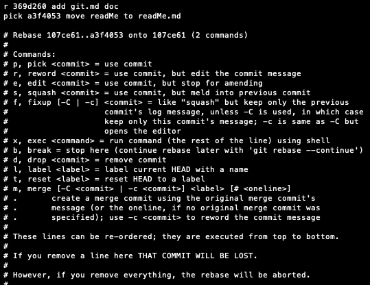

# Git 安装
## Git 官方网站
https://git-scm.com/book/en/v2

**官方安装网址** ：https://git-scm.com/book/en/v2/Getting-Started-Installing-Git

**Mac下安装**：


##设置全局变量
```git config --global --list
git config --global user.name 'ada'
git config --global user.email 'ada@163.com'
--global 
--local
--system
```

# 创建仓库
1. 在已经存在的代码下`git init`

2. 新建仓库，进入目标文件夹`git init my_folder`
   
ls -al 查看 有 .git文件
```
//把需要git管控的文件加入进来 
git add readMe 
//查看文件状态 
git status
//提交文件 -m加修改原因
git commit -m 'create readMe'    
//添加到暂存区+提交一起做
git commit -am ‘create readMe’     
//查看提交日志
git log
```

# git工作区和暂存区

//提交单个文件到暂存区
git add readMe
//提交目录下所有文件到暂存区
git add -u

## 
```
//清理暂存区工作路径上所有的文件删掉  慎用 (不是从暂存区回到工作区，而是直接删掉了暂存去里的文件)

git reset --hard
```
```
ibaobao:Git bao$ ls
Git.md			Mac-Git_Install.png
readMe
ibaobao:Git bao$ git add Mac-Git_Install.png
ibaobao:Git bao$ git status
On branch master
Changes to be committed:
  (use "git restore --staged <file>..." to unstage)
	new file:   Mac-Git_Install.png

ibaobao:Git bao$ git reset --hard
HEAD is now at 36f5ff3 add git.md
ibaobao:Git bao$ git status
On branch master
nothing to commit, working tree clean
ibaobao:Git bao$ git status
On branch master
nothing to commit, working tree clean
ibaobao:Git bao$ ls -la
total 16
drwxr-xr-x   5 bao  staff  160  9  7 14:33 .
drwxr-xr-x@  3 bao  staff   96  8 26 11:50 ..
drwxr-xr-x  14 bao  staff  448  9  7 14:33 .git
-rw-r--r--@  1 bao  staff  226  8 31 11:30 Git.md
-rw-r--r--   1 bao  staff   20  9  7 11:47 readMe
```


# 文件重命名
```
git mv readMe readMe.md
git commit -m 'move readMe to readMe.md'
```

```
ibaobao:Git bao$ git mv readMe readMe.md
ibaobao:Git bao$ git status
On branch master
Changes to be committed:
  (use "git restore --staged <file>..." to unstage)
	renamed:    readMe -> readMe.md

ibaobao:Git bao$ git commit -m 'move readMe to readMe.md'
[master 98072d3] move readMe to readMe.md
 1 file changed, 0 insertions(+), 0 deletions(-)
 rename readMe => readMe.md (100%)
```
# 查看文件的演变历史
## 通过gitlog来看文件演变历史 -命令行
```
git log --oneline
//最近两个历史
git log -n2
git log -n2 --oneline 

//-all看所有分支，默认看当前分支
git log -all
git log --oneline -all
//看指定分支
git log --oneline temp
//-graph 可以看出分支结构
git log --oneline --all --graph
//查看分支
git branch -av
//切换分支     .git/HEAD 里记录了这个信息
git checkout master
//基于一个提交创建新的分支temp
git checkout -b temp 132434314
```

```
ibaobao:Git bao$ git log --oneline --all --graph
* b68bf95 (HEAD -> temp) Add temp branch fix
| * 98072d3 (master) move readMe to readMe.md
|/  
* 36f5ff3 add git.md
* 107ce61 Add readMe
```

```
ibaobao:Git bao$ git branch -v
* master 98072d3 move readMe to readMe.md
ibaobao:Git bao$ git log
commit 98072d3b9d009657ab99fd7c91f13a9e9c66274e (HEAD -> master)
Author: Ada <wangjiejingada@163.com>
Date:   Tue Sep 7 14:39:24 2021 +0800

    move readMe to readMe.md

commit 36f5ff39ae469e013af1f8e00d4d3d31c891ce7e
Author: Ada <wangjiejingada@163.com>
Date:   Tue Sep 7 14:16:51 2021 +0800

    add git.md

commit 107ce61751119390133c0cfdbfa38eca801091d1
Author: Ada <wangjiejingada@163.com>
Date:   Tue Sep 7 11:50:42 2021 +0800

    Add readMe
ibaobao:Git bao$ git checkout -b temp 36f5ff39ae469e013af1f8e00d4d3d31c891ce7e
Switched to a new branch 'temp'
ibaobao:Git bao$ git branch -v
  master 98072d3 move readMe to readMe.md
* temp   36f5ff3 add git.md

```

## 图形界面gitk看版本历史
`gitk` 就会弹出图形界面


# .git里的秘密
```
//看是什么信息 -t 看类型 -p 看内容/tree
git cat-file -t 98072d3b9d009657ab99fd7c91f13a9e9c66274e
```
**HEAD**

修改HEAD的内容相当于运行切换分支的命令 
`git checkout temp`

```
ibaobao:Git bao$ ls
Git.md		readMe.md
ibaobao:Git bao$ git status
On branch master
nothing to commit, working tree clean
ibaobao:Git bao$ git checkout temp
Switched to branch 'temp'
ibaobao:Git bao$ git status
On branch temp
nothing to commit, working tree clean

baobao:Git bao$ cd .git
ibaobao:.git bao$ cat HEAD
ref: refs/heads/temp
```

**refs**
存放各个分支或者tag的信息
```
ibaobao:.git bao$ cd refs
ibaobao:refs bao$ ls
heads	tags
ibaobao:refs bao$ cd heads
ibaobao:heads bao$ ls
master	temp
ibaobao:heads bao$ cat master
98072d3b9d009657ab99fd7c91f13a9e9c66274e     //存放的时候指向最后一次commit的指针
ibaobao:heads bao$ git cat-file -t 98072d3b9d009657ab99fd7c91f13a9e9c66274e
commit
ibaobao:heads bao$ git branch -av
* master 98072d3 move readMe to readMe.md
  temp   b68bf95 Add temp branch fix
ibaobao:heads bao$ pwd
/Users/bao/Documents/10-MyNotes/Git/.git/refs/heads
````

**objects**
```
ibaobao:.git bao$ ls
COMMIT_EDITMSG	branches	gitk.cache	info		refs
HEAD		config		hooks		logs
ORIG_HEAD	description	index		objects
ibaobao:.git bao$ cd objects
ibaobao:objects bao$ ls
01	36	75	8a	b6	e1	info
10	72	88	98	c3	ee	pack
ibaobao:objects bao$ cd e1
ibaobao:e1 bao$ ls
e54661083e1607025a01aed09f8dc840feab68
ibaobao:e1 bao$ git cat-file -t e54661083e1607025a01aed09f8dc840feab68
fatal: Not a valid object name e54661083e1607025a01aed09f8dc840feab68
//策略是文件夹名+里边的文件名 
ibaobao:e1 bao$ git cat-file -t e1e54661083e1607025a01aed09f8dc840feab68
tree
ibaobao:e1 bao$ git cat-file -p e1e54661083e1607025a01aed09f8dc840feab68
100644 blob 759f1a6802ef40d7c78ffbaf6fa5c24d4c1c6de4	Git.md
100644 blob c35b048ef38dc71c4b397bfd104d377fc352838a	readMe.md
ibaobao:e1 bao$ git cat-file -t 759f1a6802ef40d7c78ffbaf6fa5c24d4c1c6de4
blob
ibaobao:e1 bao$ git cat-file -p 759f1a6802ef40d7c78ffbaf6fa5c24d4c1c6de4
##Git 官方网站
https://git-scm.com/book/en/v2
## Git 安装
**官方安装网址** ：https://git-scm.com/book/en/v2/Getting-Started-Installing-Git

**Mac下安装**：
```

# git对象彼此关系 commit tree blob
tree相当于一个文件夹
blob具体的文件


# 分离头指针 detached head
> 从某个commit checkout出来但是没有创建分支，会产生分离头指针，需要注意。

> 分离头指针没有和某个分支branch绑定到一起，其上面做的变更会被git一段时间后清理理掉，如果需要保存，则要创建分支

```
ibaobao:Git bao$ git log
commit 98072d3b9d009657ab99fd7c91f13a9e9c66274e (HEAD -> master)
Author: Ada <wangjiejingada@163.com>
Date:   Tue Sep 7 14:39:24 2021 +0800

    move readMe to readMe.md

commit 36f5ff39ae469e013af1f8e00d4d3d31c891ce7e
Author: Ada <wangjiejingada@163.com>
Date:   Tue Sep 7 14:16:51 2021 +0800

    add git.md

commit 107ce61751119390133c0cfdbfa38eca801091d1
Author: Ada <wangjiejingada@163.com>
Date:   Tue Sep 7 11:50:42 2021 +0800

    Add readMe
ibaobao:Git bao$ git checkout 107ce61751119390133c0cfdbfa38eca801091d1
Note: switching to '107ce61751119390133c0cfdbfa38eca801091d1'.

You are in 'detached HEAD' state. You can look around, make experimental
changes and commit them, and you can discard any commits you make in this
state without impacting any branches by switching back to a branch.

If you want to create a new branch to retain commits you create, you may
do so (now or later) by using -c with the switch command. Example:

  git switch -c <new-branch-name>

Or undo this operation with:

  git switch -

Turn off this advice by setting config variable advice.detachedHead to false

HEAD is now at 107ce61 Add readMe
ibaobao:Git bao$ git switch -
Previous HEAD position was 107ce61 Add readMe
Switched to branch 'master'
ibaobao:Git bao$ git log
commit 98072d3b9d009657ab99fd7c91f13a9e9c66274e (HEAD -> master)
Author: Ada <wangjiejingada@163.com>
Date:   Tue Sep 7 14:39:24 2021 +0800

    move readMe to readMe.md

commit 36f5ff39ae469e013af1f8e00d4d3d31c891ce7e
Author: Ada <wangjiejingada@163.com>
Date:   Tue Sep 7 14:16:51 2021 +0800

    add git.md

commit 107ce61751119390133c0cfdbfa38eca801091d1
Author: Ada <wangjiejingada@163.com>
Date:   Tue Sep 7 11:50:42 2021 +0800

    Add readMe
ibaobao:Git bao$ git checkout 107ce61751119390133c0cfdbfa38eca801091d1
Note: switching to '107ce61751119390133c0cfdbfa38eca801091d1'.

You are in 'detached HEAD' state. You can look around, make experimental
changes and commit them, and you can discard any commits you make in this
state without impacting any branches by switching back to a branch.

If you want to create a new branch to retain commits you create, you may
do so (now or later) by using -c with the switch command. Example:

  git switch -c <new-branch-name>

Or undo this operation with:

  git switch -

Turn off this advice by setting config variable advice.detachedHead to false

HEAD is now at 107ce61 Add readMe
ibaobao:Git bao$ ls
readMe
ibaobao:Git bao$ git switch -
Previous HEAD position was 107ce61 Add readMe
Switched to branch 'master'
ibaobao:Git bao$ ls
Git.md		readMe.md
ibaobao:Git bao$ git checkout 107ce61751119390133c0cfdbfa38eca801091d1
Note: switching to '107ce61751119390133c0cfdbfa38eca801091d1'.

You are in 'detached HEAD' state. You can look around, make experimental
changes and commit them, and you can discard any commits you make in this
state without impacting any branches by switching back to a branch.

If you want to create a new branch to retain commits you create, you may
do so (now or later) by using -c with the switch command. Example:

  git switch -c <new-branch-name>

Or undo this operation with:

  git switch -

Turn off this advice by setting config variable advice.detachedHead to false

HEAD is now at 107ce61 Add readMe
ibaobao:Git bao$ ls
readMe
ibaobao:Git bao$ vi readMe
ibaobao:Git bao$ git status
HEAD detached at 107ce61
Changes not staged for commit:
  (use "git add <file>..." to update what will be committed)
  (use "git restore <file>..." to discard changes in working directory)
	modified:   readMe

no changes added to commit (use "git add" and/or "git commit -a")
ibaobao:Git bao$ git commit -am'add detached head comment'
[detached HEAD 4883338] add detached head comment
 1 file changed, 1 insertion(+)
ibaobao:Git bao$ ls
readMe
ibaobao:Git bao$ git log
commit 4883338f92d3cc50f4ed4a958b09cd22ee24a6b6 (HEAD)
Author: Ada <wangjiejingada@163.com>
Date:   Wed Sep 8 11:16:59 2021 +0800

    add detached head comment

commit 107ce61751119390133c0cfdbfa38eca801091d1
Author: Ada <wangjiejingada@163.com>
Date:   Tue Sep 7 11:50:42 2021 +0800

    Add readMe
ibaobao:Git bao$ gitk --all
ibaobao:Git bao$ git checkout master
Warning: you are leaving 1 commit behind, not connected to
any of your branches:

  4883338 add detached head comment

If you want to keep it by creating a new branch, this may be a good time
to do so with:

 git branch <new-branch-name> 4883338

Switched to branch 'master'
ibaobao:Git bao$ gitk --all
ibaobao:Git bao$ git branch fix_defect01 4883338
ibaobao:Git bao$ gitk --all
```

# HEAD 和 branch

HEAD的一些用法
>可以用作标识符，快速指代commit
>
>HEAD 当前commit
>
>HEAD^ 上一个commit  （或者HEAD～）
>
>HEAD^^ 上上一个commit  （或者HEAD～2）

//查看分支
`git branch -ava`

//新建分支并切换
`git checkout -b new_branch_name old_branch（或者指定commit）`

//比较分支
git diff HEAD HEAD^
git diff HEAD HEAD~
```
ibaobao:Git bao$ git branch -av
  fix_defect01 4883338 add detached head comment
* master       98072d3 move readMe to readMe.md
  temp         b68bf95 Add temp branch fix
ibaobao:Git bao$ git log
commit 98072d3b9d009657ab99fd7c91f13a9e9c66274e (HEAD -> master)
Author: Ada <wangjiejingada@163.com>
Date:   Tue Sep 7 14:39:24 2021 +0800

    move readMe to readMe.md

commit 36f5ff39ae469e013af1f8e00d4d3d31c891ce7e
Author: Ada <wangjiejingada@163.com>
Date:   Tue Sep 7 14:16:51 2021 +0800

    add git.md

commit 107ce61751119390133c0cfdbfa38eca801091d1
Author: Ada <wangjiejingada@163.com>
Date:   Tue Sep 7 11:50:42 2021 +0800

    Add readMe
ibaobao:Git bao$ git checkout -b fix_readMe fix_defect01
Switched to a new branch 'fix_readMe'
ibaobao:Git bao$ git log -n1
commit 4883338f92d3cc50f4ed4a958b09cd22ee24a6b6 (HEAD -> fix_readMe, fix_defect01)
Author: Ada <wangjiejingada@163.com>
Date:   Wed Sep 8 11:16:59 2021 +0800

    add detached head comment
ibaobao:Git bao$ git branch -av
  fix_defect01 4883338 add detached head comment
* fix_readMe   4883338 add detached head comment
  master       98072d3 move readMe to readMe.md
  temp         b68bf95 Add temp branch fix
ibaobao:Git bao$ cat .git/HEAD
ref: refs/heads/fix_readMe
ibaobao:Git bao$ gitk --all
DEPRECATION WARNING: The system version of Tk is deprecated and may be removed in a future release. Please don't rely on it. Set TK_SILENCE_DEPRECATION=1 to suppress this warning.
2021-09-08 11:53:41.120 Wish[72889:2910006] CoreText note: Client requested name ".SFNSMono-Regular", it will get Times-Roman rather than the intended font. All system UI font access should be through proper APIs such as CTFontCreateUIFontForLanguage() or +[NSFont systemFontOfSize:].
2021-09-08 11:53:41.120 Wish[72889:2910006] CoreText note: Set a breakpoint on CTFontLogSystemFontNameRequest to debug.
2021-09-08 11:53:41.214 Wish[72889:2910006] CoreText note: Client requested name ".SF NS Mono", it will get Times-Roman rather than the intended font. All system UI font access should be through proper APIs such as CTFontCreateUIFontForLanguage() or +[NSFont systemFontOfSize:].
ibaobao:Git bao$ git log
commit 4883338f92d3cc50f4ed4a958b09cd22ee24a6b6 (HEAD -> fix_readMe, fix_defect01)
Author: Ada <wangjiejingada@163.com>
Date:   Wed Sep 8 11:16:59 2021 +0800

    add detached head comment

commit 107ce61751119390133c0cfdbfa38eca801091d1
Author: Ada <wangjiejingada@163.com>
Date:   Tue Sep 7 11:50:42 2021 +0800

    Add readMe
ibaobao:Git bao$ git diff 4883338f 107ce617
diff --git a/readMe b/readMe
index 28385ce..c35b048 100644
--- a/readMe
+++ b/readMe
@@ -1,2 +1 @@
 this is readMe v1.0
-this is in detached head
ibaobao:Git bao$ git diff 107ce617 4883338f
diff --git a/readMe b/readMe
index c35b048..28385ce 100644
--- a/readMe
+++ b/readMe
@@ -1 +1,2 @@
 this is readMe v1.0
+this is in detached head
ibaobao:Git bao$ git diff HEAD HEAD^
diff --git a/readMe b/readMe
index 28385ce..c35b048 100644
--- a/readMe
+++ b/readMe
@@ -1,2 +1 @@
 this is readMe v1.0
-this is in detached head
ibaobao:Git bao$ git diff HEAD^ HEAD
diff --git a/readMe b/readMe
index c35b048..28385ce 100644
--- a/readMe
+++ b/readMe
@@ -1 +1,2 @@
 this is readMe v1.0
+this is in detached head
ibaobao:Git bao$ git diff HEAD^ HEAD^^
fatal: ambiguous argument 'HEAD^^': unknown revision or path not in the working tree.
Use '--' to separate paths from revisions, like this:
'git <command> [<revision>...] -- [<file>...]'
```

# 修改commit的message  【在自己的分支上变更】

修改当前分支最近一次commit 的message
`git commit --amend`
对任意的commit修改message
`git rebase -i parent_commit_no`
```

ibaobao:Git bao$ git commit --amend
[fix_readMe ff12d60] add detached head comments
 Date: Wed Sep 8 11:16:59 2021 +0800
 1 file changed, 1 insertion(+)


ibaobao:Git bao$ git log
commit 284e2cf4754cd2140c8cbbf1717690ad65fe98d6 (HEAD -> fix_readMe)
Author: Ada <wangjiejingada@163.com>
Date:   Wed Sep 8 11:16:59 2021 +0800

    add detached head comments

commit 107ce61751119390133c0cfdbfa38eca801091d1
Author: Ada <wangjiejingada@163.com>
Date:   Tue Sep 7 11:50:42 2021 +0800

    Add readMe
ibaobao:Git bao$ git checkout master
Switched to branch 'master'
ibaobao:Git bao$ git log
commit 98072d3b9d009657ab99fd7c91f13a9e9c66274e (HEAD -> master)
Author: Ada <wangjiejingada@163.com>
Date:   Tue Sep 7 14:39:24 2021 +0800

    move readMe to readMe.md

commit 36f5ff39ae469e013af1f8e00d4d3d31c891ce7e
Author: Ada <wangjiejingada@163.com>
Date:   Tue Sep 7 14:16:51 2021 +0800

    add git.md

commit 107ce61751119390133c0cfdbfa38eca801091d1
Author: Ada <wangjiejingada@163.com>
Date:   Tue Sep 7 11:50:42 2021 +0800

    Add readMe
ibaobao:Git bao$ git rebase -i 107ce61751119390133c0cfdbfa38eca801091d1
[detached HEAD 369d260] add git.md doc
 Date: Tue Sep 7 14:16:51 2021 +0800
 1 file changed, 8 insertions(+)
 create mode 100644 Git.md
Successfully rebased and updated refs/heads/master.
```


# 合并commit

## 合并历史树中连续的几个commit

`git rebase -i parent_commmit`
>use squash

<image src="./image/rebase_combine_commit" style="zoom:100%;" />

```
ibaobao:Git bao$ git log
commit 9546e6d447873a5bff8cddf62f656dd36d750116 (HEAD -> master)
Author: Ada <wangjiejingada@163.com>
Date:   Wed Sep 8 14:46:14 2021 +0800

    Add image

commit a3f405334356202cce5efaf5888f17c7038814ec
Author: Ada <wangjiejingada@163.com>
Date:   Tue Sep 7 14:39:24 2021 +0800

    move readMe to readMe.md

commit 369d260ebeea450f377b664549a3414368ebda5d
Author: Ada <wangjiejingada@163.com>
Date:   Tue Sep 7 14:16:51 2021 +0800

    add git.md doc

commit 107ce61751119390133c0cfdbfa38eca801091d1
Author: Ada <wangjiejingada@163.com>
Date:   Tue Sep 7 11:50:42 2021 +0800

    Add readMe
ibaobao:Git bao$ git rebase -i 107ce61751119390133c0cfdbfa38eca801091d1
[detached HEAD 80df236] To create a complete git.md with image
 Date: Tue Sep 7 14:16:51 2021 +0800
 2 files changed, 8 insertions(+)
 create mode 100644 Git.md
 rename readMe => readMe.md (100%)
Successfully rebased and updated refs/heads/master.
ibaobao:Git bao$ git log
commit 6c435f6c96d3f98f9d8b164adf8143608190ad6e (HEAD -> master)
Author: Ada <wangjiejingada@163.com>
Date:   Wed Sep 8 14:46:14 2021 +0800

    Add image

commit 80df2361de593f362ce9b64398209b9ceba3a5a0
Author: Ada <wangjiejingada@163.com>
Date:   Tue Sep 7 14:16:51 2021 +0800

    To create a complete git.md with image
    
    add git.md doc
    
    move readMe to readMe.md

commit 107ce61751119390133c0cfdbfa38eca801091d1
Author: Ada <wangjiejingada@163.com>
Date:   Tue Sep 7 11:50:42 2021 +0800

    Add readMe
```

## 合并不连续的commit
`git rebase -i parent_commit_no`
在交互的时候，把不连续的需要合并的commit拷贝到一起，然后squash

# 如何比较暂存区和HEAD的文件


